+++
# Date this page was created.
date = 2018-11-10T00:00:00
layout = "project"

# Project title.
title = "1. Expedia Project"

# Project summary to display on homepage.
summary = """
This is a study abroad project that took place in Vienna, Austria.  
My group collaborated with an Austrian Semantic Web Company who wanted to establish a long-term partnership with Expedia. My group built cognitive Artificial Intelligence solutions to help the clients from Expedia enhancing the user experience of low vision travelers in Austria. 
 """
 
image_preview = "expedia.jpg"

# Tags: can be used for filtering projects.
# Example: `tags = ["Computer Graphics", "Rendering"]`
tags = ["Computer Graphics","Rendering"]

# Optional external URL for project (replaces project detail page).
external_link = ""

# [header]
# image = "expedia.jpg"

+++

# Overview
This is a Monte-Carlo rendering system that supports global illumination, interpolating parameters, texture mapping, bounding volume hierarchy accelerating, and depth of field effected rendering, etc.. 
I independently accomplished it under the guidance of Prof. Pradeep Sen.  

The main accomplishments carried out by my groups are:  
1. Created user personas, user scenarios, and knowledge graphs to identify the needs, goals, and behaviors of low vision travellers. 
2. Built an AI knowledge Graph to enhance the experience of low vision travelers using Expedia.  
3. Developed a whole set of taxonomy and ontology using PoolParty Semantic Suites and connected content from Google Maps, Municipal Data, and other open-source data such as Wikivoyage to expand the database. 
4. Used SPARQL Queries to extract data from open-source database and delivered data to users’ phones or tablets.

# Features
## Ray Tracing

The first step of this system is to implement a basic Whitted-style ray tracer. Features like reflection, refraction, and shadowing are supported.

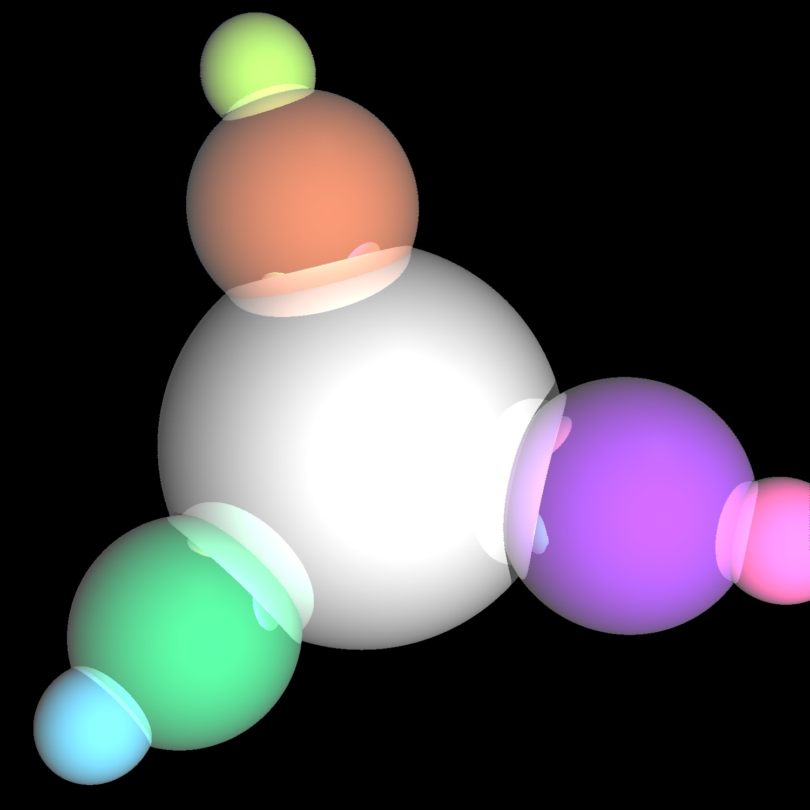

Then, I Improved it to support more shaders, such as texture mapping and interpolating parameters.
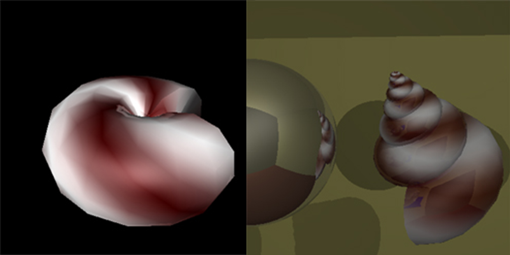

To render complex scenes, I added a heuristic bounding volume hierarchy (BVH) to store the primitives in an efficient manner. Also, I optimize the sphere and triangle intersection routines. In most scenes, the speed of rendering has been accelerated by more than 50x.

A complex scene rendered within 2 minutes:
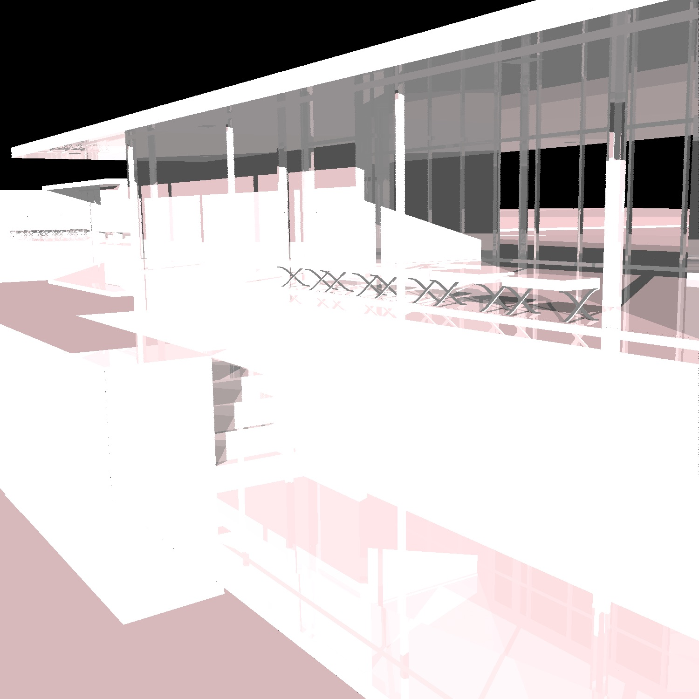

Now, it is the time to implement path tracing!

## Monte-Carlo integration & Path Tracing

To support pixel antialiasing, I implemented a box filter over the pixel footprint and depth of field by integrating over the aperture of the camera illustrated as follows:

As for the depth-of-field effect, I simulated an imaginary thin lens with a fixed aperture to produce a nice depth-of-field effect, where some objects will be sharp but others blurry.

Original scene:
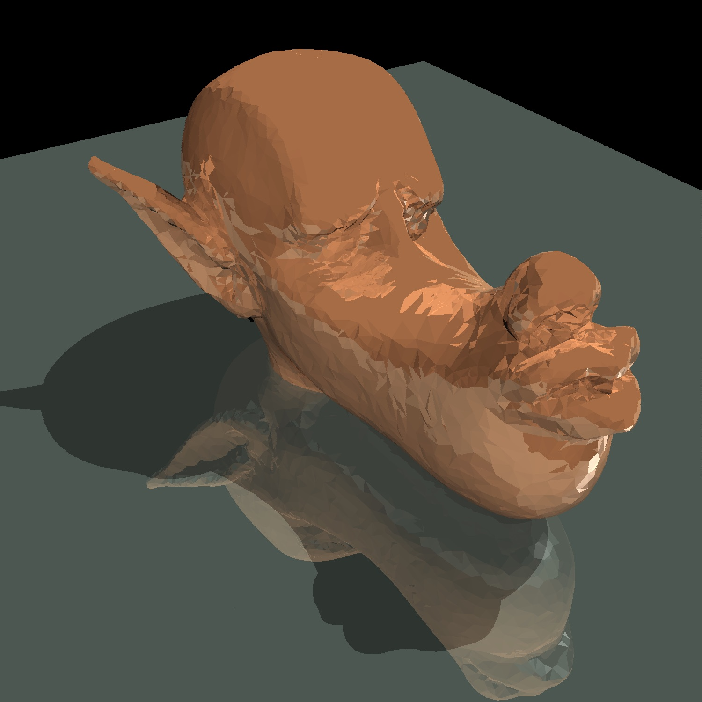

Depth-of-field effected scene:
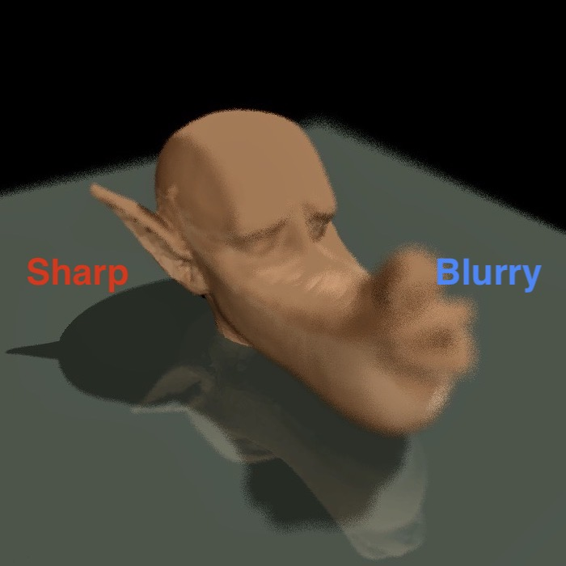

Now, here is the most important part! 
A basic Monte-Carlo estimater was implemented to sample radiance of the hemisphere.
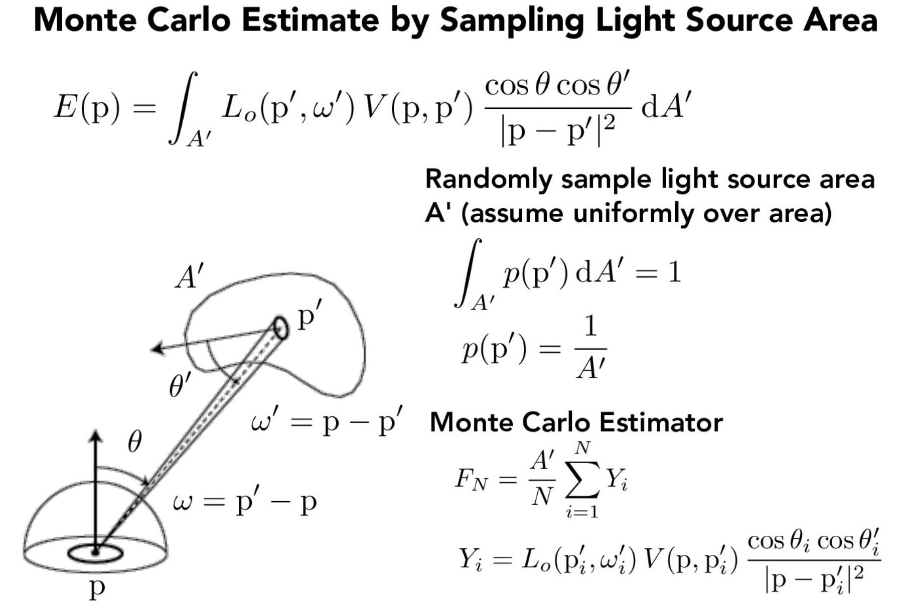
By integrating the radiance coming from the hemisphere, we could estimate the radiance of indirect illumination. So far, we can get the global illuminated scenes as follows.
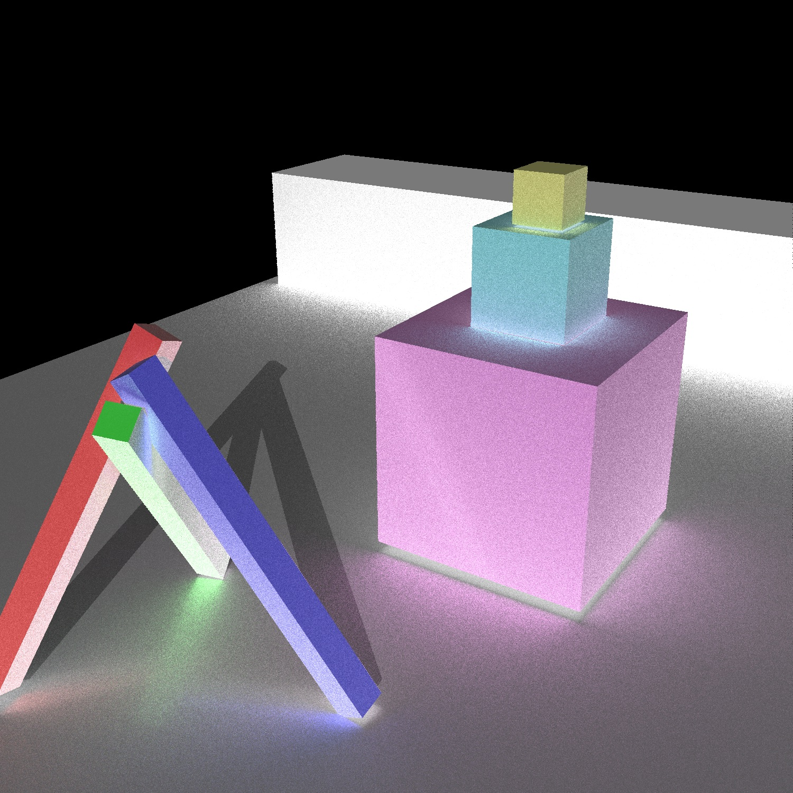

## Final thesis

Also, I added a basic volumetic scattering effect estimater in this path tracer and wrote a final paper in SIGGRAPH tamplate which discussed principles of volumetic rendering and path tracing.

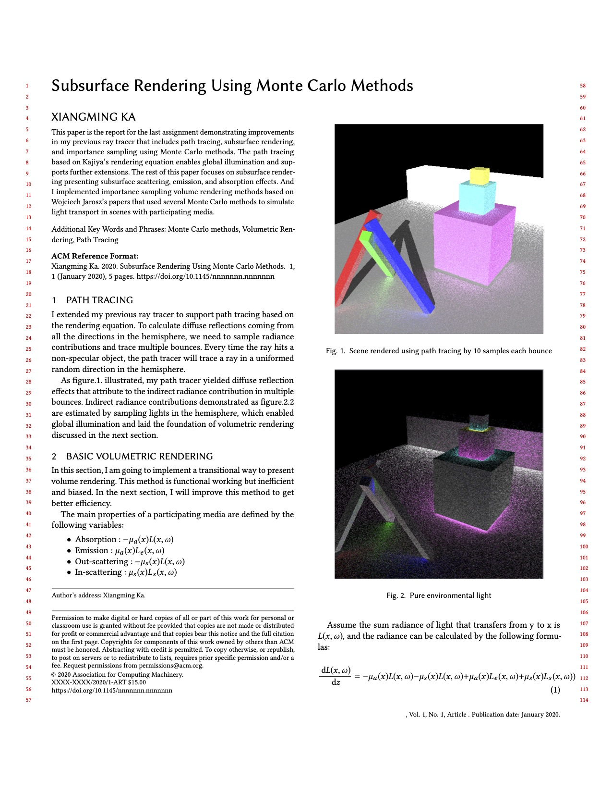

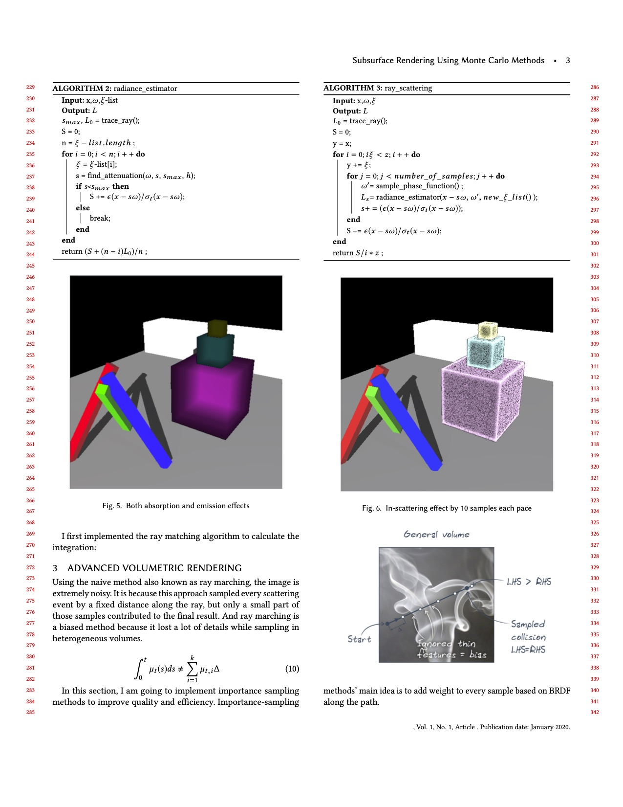
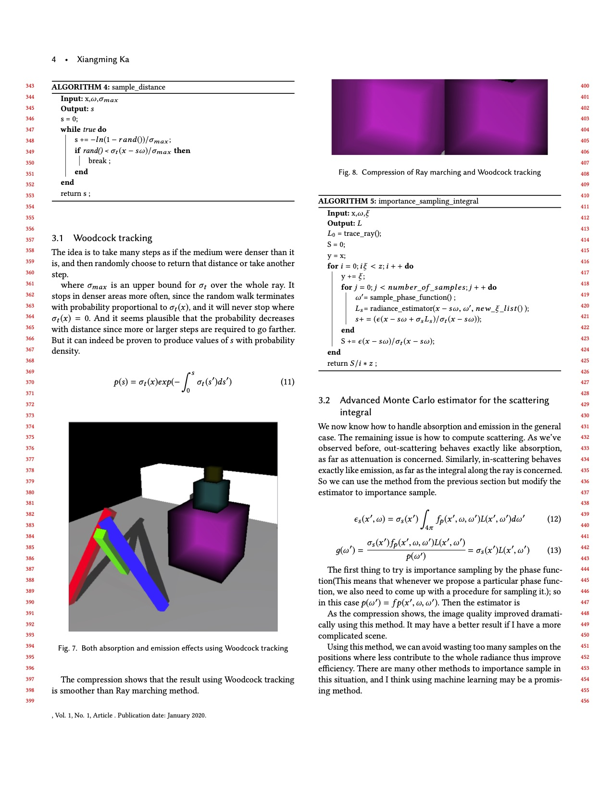
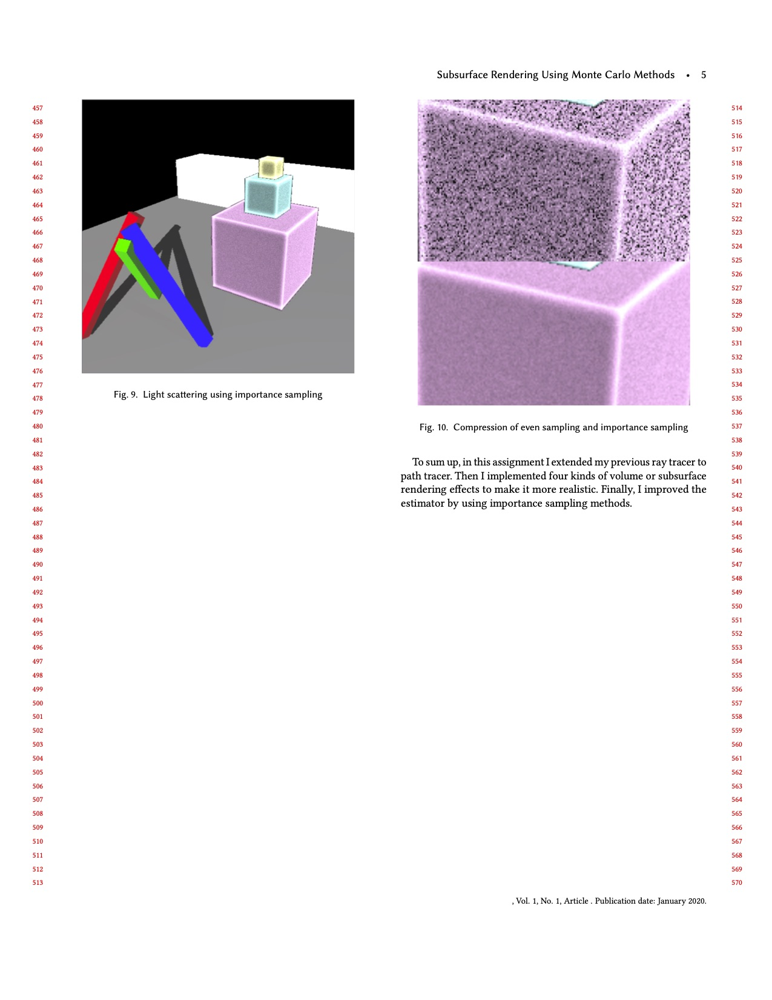

For more information and source code: https://github.com/XiangmingKA/PathTracer
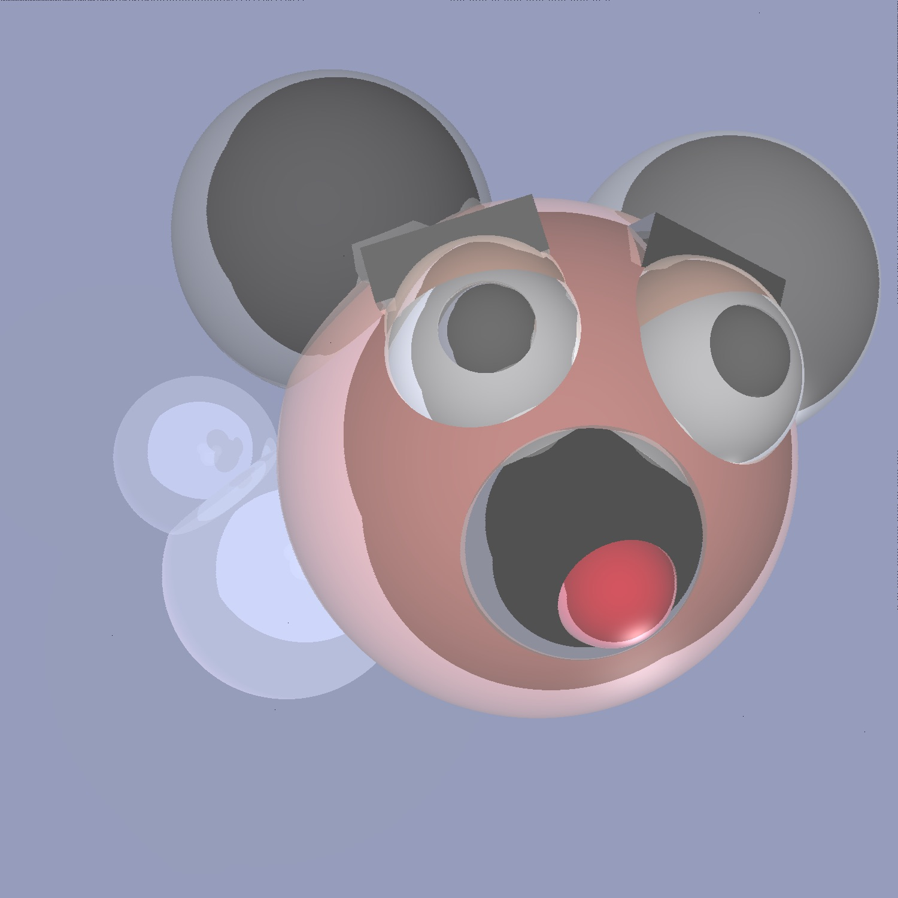

