+++
# Date this page was created.
date = 2018-11-10T00:00:00
layout = "project"

# Project title.
title = "1. Expedia Project"

# Project summary to display on homepage.
summary = """
My group collaborated with an Austrian Semantic Web Company who wanted to establish a long-term partnership with Expedia. We built cognitive Artificial Intelligence solutions to help the clients from Expedia enhancing the user experience of low vision travelers in Austria. 
 """
 
image_preview = "cover.jpg"

# Tags: can be used for filtering projects.
# Example: `tags = ["Computer Graphics", "Rendering"]`
tags = ["App Wireframe Design"]

# Optional external URL for project (replaces project detail page).
external_link = ""

# [header]
# <<<<<<< HEAD:content/project/1 expedia/index.md

# image = "img/expedia.jpg"
# =======
# image = "expedia.jpg"

+++

# Overview
This project aimed to help the clients from Expedia by building an AI knowledge Graph to enhance the experience of low vision travelers in Austria. During the project, my group organized and extracted data from open-source database and delivered data to users’ phones or tablets. 
I was user experience researcher and prototype designer.  

The main accomplishments carried out by my groups are:  
1. Created user personas, user scenarios, and knowledge graphs to identify the needs, goals, and behaviors of low vision travellers. 
2. Built an AI knowledge Graph to enhance the experience of low vision travelers using Expedia.  
3. Developed a whole set of taxonomy and ontology using PoolParty Semantic Suites and connected content from Google Maps, Municipal Data, and other open-source data such as Wikivoyage to expand the database. 
4. Used SPARQL Queries to extract data from open-source database and delivered data to users’ phones or tablets.

# Features
## User Research
### Personas

In order to identify the needs, behaviors, and goals of our target users, I created some user personas (Fictional representation of typical customer) to expand the scope of our project. 
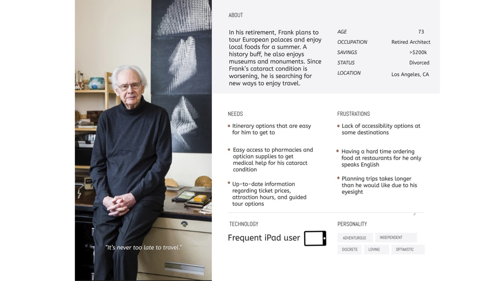
I considered that there is a higher chance for elderly people to have low- vision. And the number of senior travellers are increasing over years. So we came up with Frank’s persona and use it as our central focus.

While creating those persons, I postitioned myself as a low vision traveller and developed research upon that postition. This whole procedure helped me better identify the needs of users. For instance, It occured to me that low vision travellers might have service animals with them while travelling. Therefore they might want info about places which are guide-dogs friendly. 

### User Scenario

Then, my group created a list of queries based on Frank's persona to imitate and understand users' behaviors. 
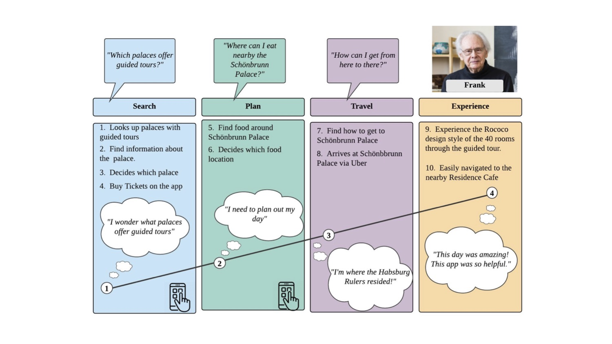

### Knowledge Graph

To understand how to achieve the goals of our target users, my group built knowledge graphs with the queries color-coded. Those knowledge graphs enabled us to identify which concepts are the results of which query, linked to their websites and the relationships tie it all together. This is the start of a complex system that can be built upon based on what Expedia wants to service.

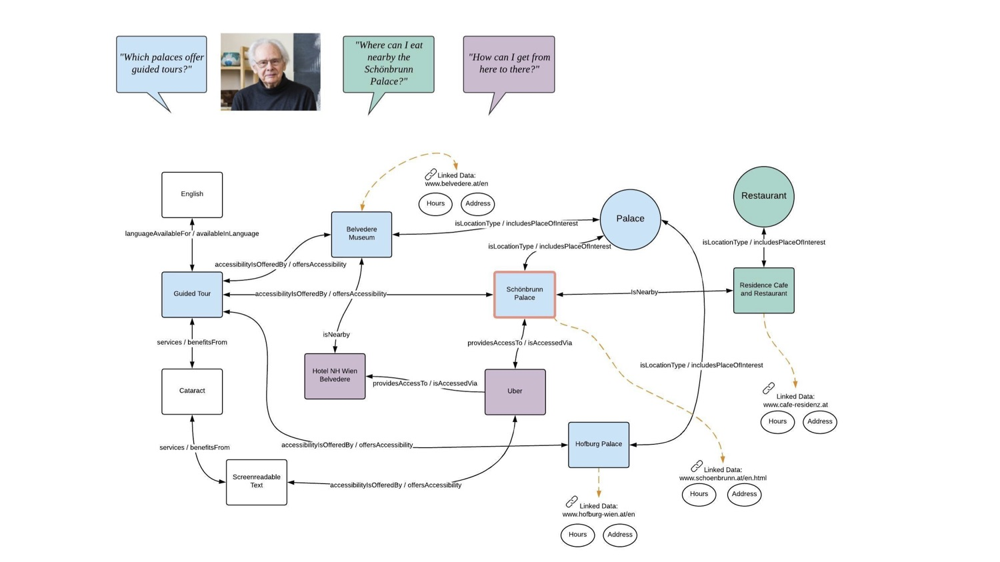

## Taxonomy

My group started building taxonomy by learning from two other existing projects about low vision traveling and built on their structure and terms. We built 11 concept schemes that focused basically on two perspectives: Accessibility and Travelling.
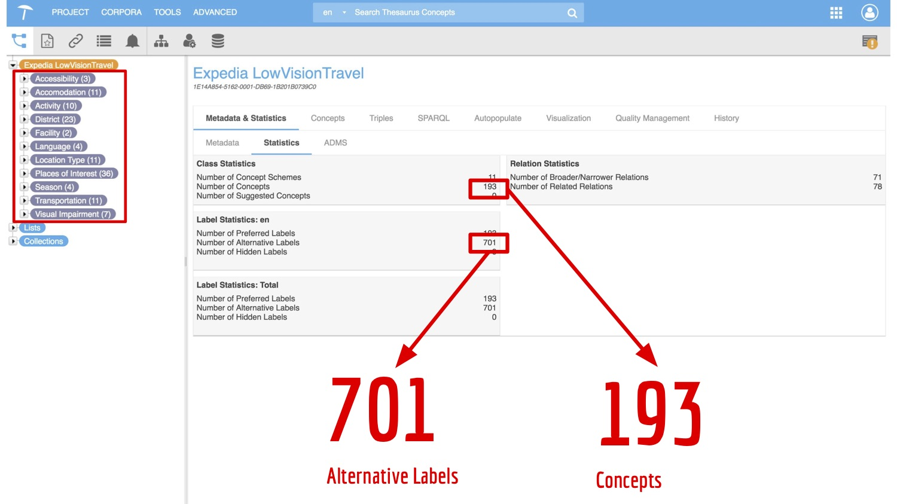

My group enriched the database by relating the personas to taxonomy, and user research made sure that all concepts were closely related to user's experience. For example, by thinking about that Frank wants to travel in summertime, we added season concept scheme.
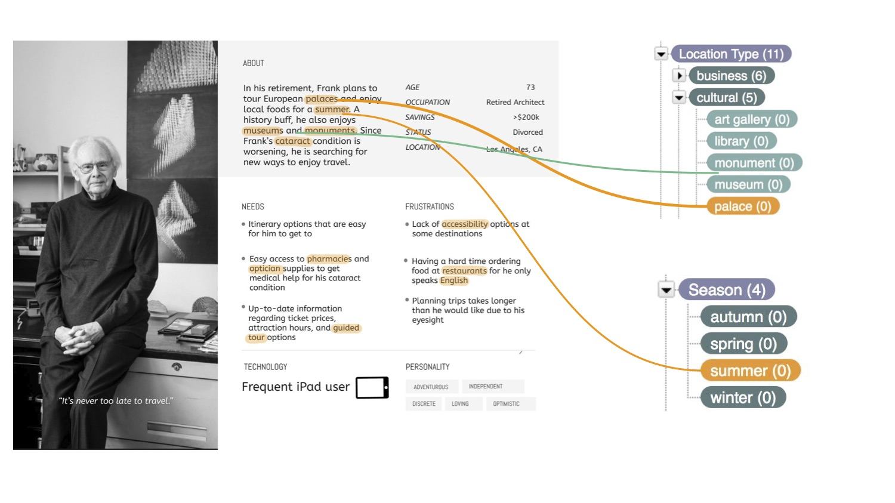

## Wireframes & User Flow

Wireframes served as a visual guide that includes most of the features available in the app. The user flow on the side of wireframes demonstrate actions made by the user from the start to the end point.

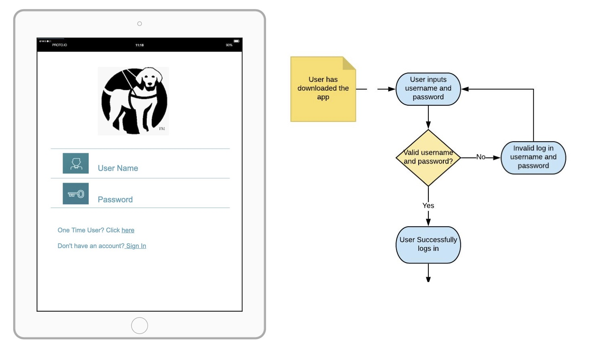

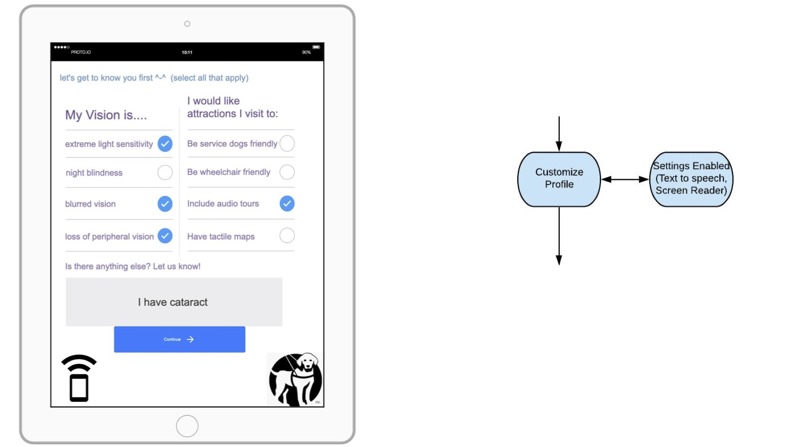

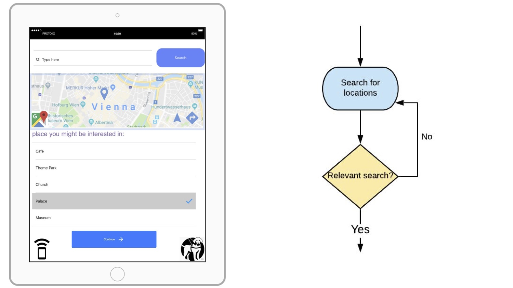

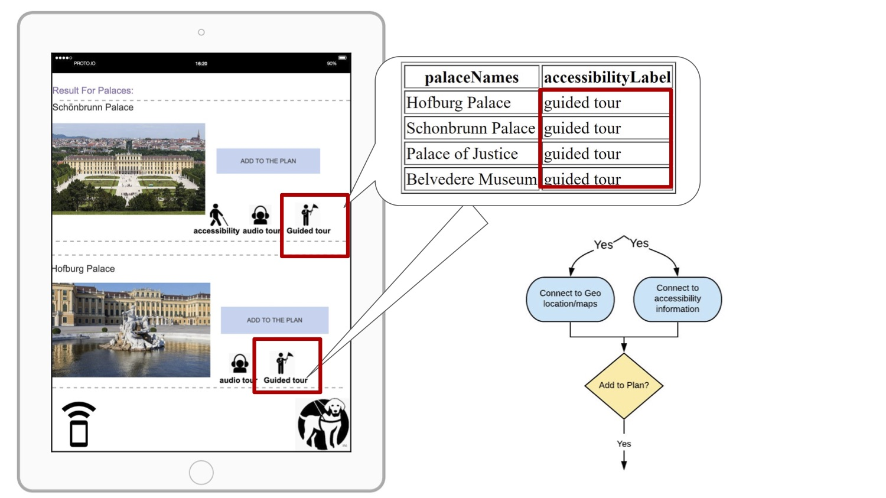

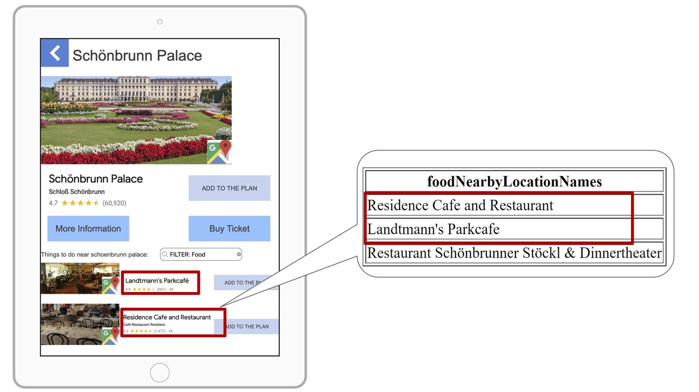

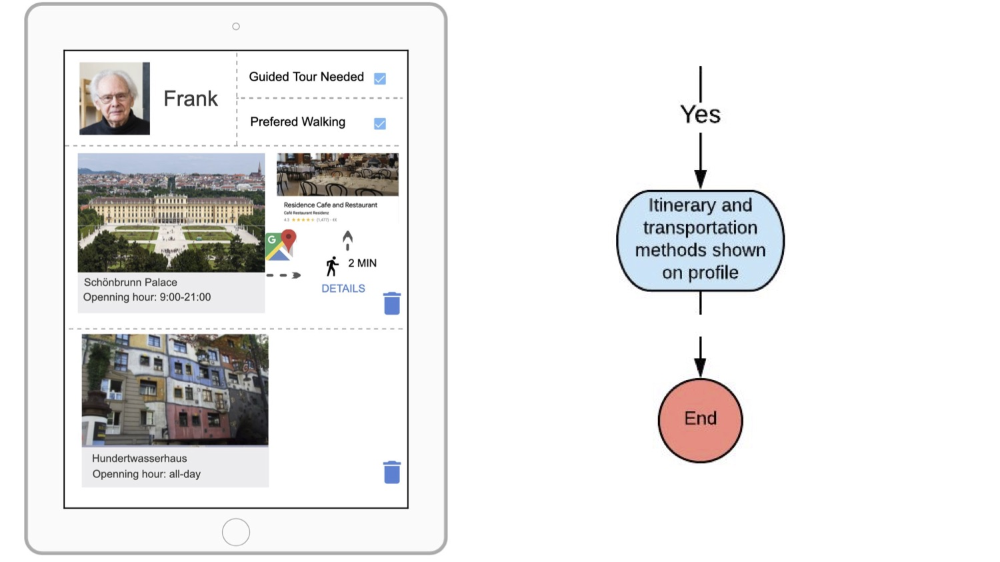

For more information and source code: https://github.com/SiwenW1998/academic-kickstart

