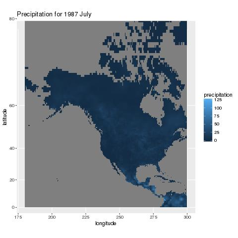

+++
# Date this page was created.
date = 2018-11-10T00:00:00
layout = "project"

# Project title.
title = "3. Temperature and Precipitation Maps"

# Project summary to display on homepage.
summary = """
This project aimed to plot temperature and precipitation maps for North America using a remote server. 
 """
 
image_preview = "img/featured.jpg"

# Tags: can be used for filtering projects.
# Example: `tags = ["Game Development", "Unreal"]`
tags = ["Data Visualization"]

# Optional external URL for project (replaces project detail page).
external_link = ""

# [header]
# image = "img/featured.jpg"

+++

# Overview
This is a data visualization project. My task is to plot temperature and precipitation maps for North America while given specific months and years (between 1960 -2014). All the data is stored in a csv file in a format similar to:  

For more information > https://github.com/info201b-wi2018/a6-remote-SiwenW1998

# Features
## I selected only observations for July 1960, July 1987, July 2014.

### July 1960 
Air Temperature

Precipitation

### July 1987
Air Temperature

Precipitation

### July 2014
Air Temperature

Precipitation

