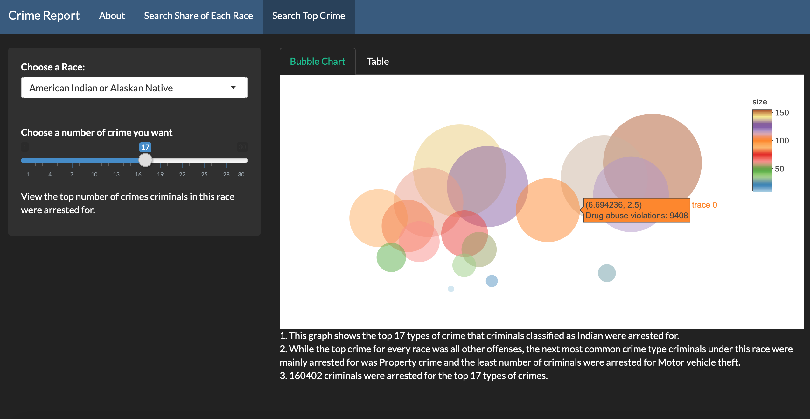
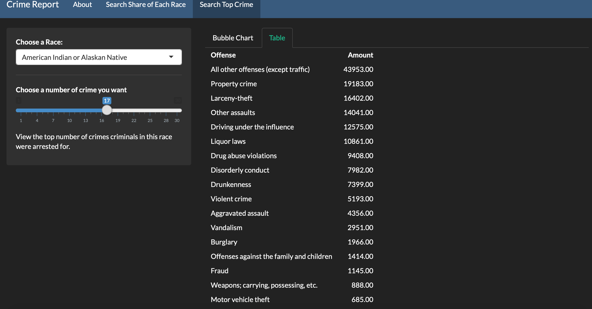
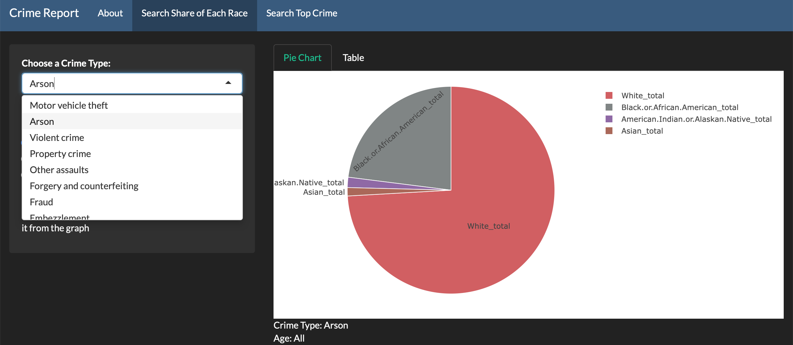
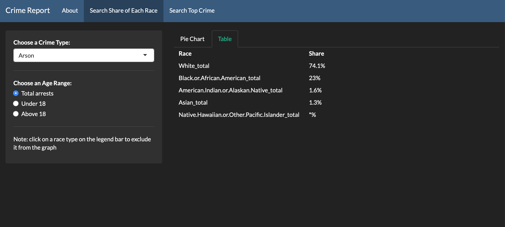

+++
# Date this page was created.
date = 2018-11-10T00:00:00
layout = "project"

# Project title.
title = "4. Visualization of Crime Report"

# Project summary to display on homepage.
summary = """
 This is a curriculum project at UW. 
 The project was based on the data that was collected and published [in 2013 by the FBI]( https://ucr.fbi.gov/crime-in-the-u.s/2013/crime-in-the-u.s.-2013/tables/table-43). The project aimed to visualize relationship between age, race and crime ,and hopefully provides insight on how to decrease crime rate in the future. 
 """
 
image_preview = "img/featured.jpg"

# Tags: can be used for filtering projects.
# Example: `tags = ["Game Development", "Unity3D"]`
tags = ["Data Visualization","Website Design"]

# Optional external URL for project (replaces project detail page).
external_link = ""

# [header]
# image = "img/featured.jpg"

+++

# Overview
This project's purpose is to provide insight into the relationship between age, race and crime. The data used for this project was collected in 2013 by the FBI and published by the Uniform Crime Report on their website. The main question we are attempting to answer through this app is whether or not a person's race and age would affect their likelihood of committing crimes. The visualization of crime report is important becuase it can provide insight on how to decrease crime rate in the future. The user can view data percentages for criminals from either all ages, those under 18 or those who are 18 and above through a pie chart and a bubble chart.

Hopefully, by viewing the data in this app, the user will be able to conclude about the nature of the relationship between race and crime. 

The link to the information we used:

* [the data of all the arrests in 2013]( https://ucr.fbi.gov/crime-in-the-u.s/2013/crime-in-the-u.s.-2013/tables/table-43)

# Features
## Bubble Chart
In the bubble chart, users could get an overall information about the Crime Report. The size of the bubble represents the population of certain race. Users could decide how many bubbles they want to see in the same char by sliding the slider in the sidebar.

Users can always see the actual data by switching to data table.

## Pie Chart
By choosing the age and race through the radio buttons, users could could get a pie chart that contain the selected information.

Users can view the actual data by switching to data table.

